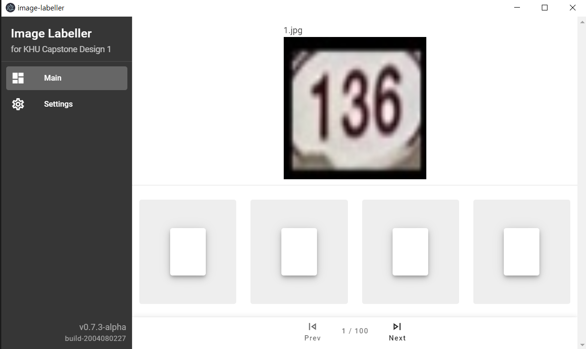

# image-labeller
Crop된 명패 이미지 분류 작업을 도와주는 툴.

### Build
```
yarn electron:build
```
dist_electron/win-unpacked 폴더에서 image-labeller.exe를 실행.

### 사용 설명
1. 좌측 사이드바에서 Settings 클릭.
2. 결과물 CSV 파일의 이름을 지정. (저장 경로는 데이터셋이 위치한 Workspace 폴더)
3. 데이터셋의 시작 파일 이름을 지정. (비어있으면 첫 파일부터 읽음)
4. 데이터셋이 위치한 폴더를 선택.
5. 좌측 사이드바에서 Main 클릭.
6. 이미지 분류 작업 시작.

* 단축키
    * 방향키 (좌/우) : 이전/다음 이미지 로딩
    * 숫자키 (0~9) : 호수 입력.
    * backspace / delete : 입력한 마지막 자리부터 제거.
    * s : CSV 파일로 저장.

* 참고 사항
    * 실제로 라벨링은 숫자 6자리로 변환됨. (hasNum, digitLen, digit1, digit2, digit3, digit4)
    * 아무것도 입력하지 않고 다음 이미지 로딩 시 [0, 0, 10, 10, 10, 10]으로 자동 라벨링됨.

