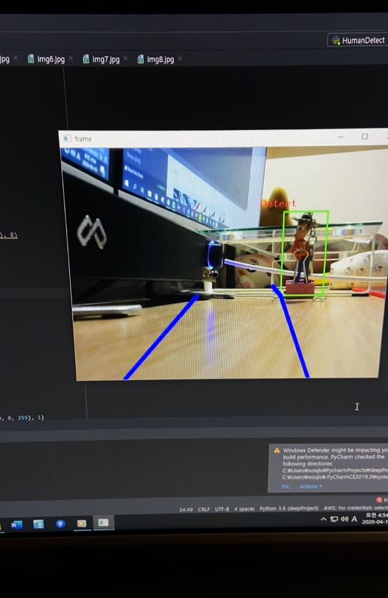
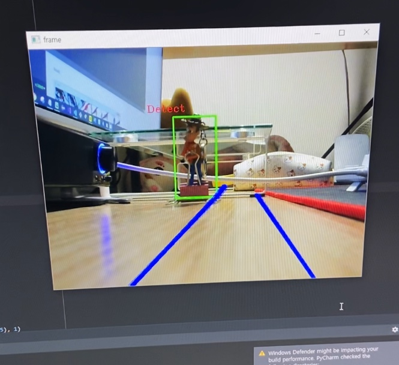
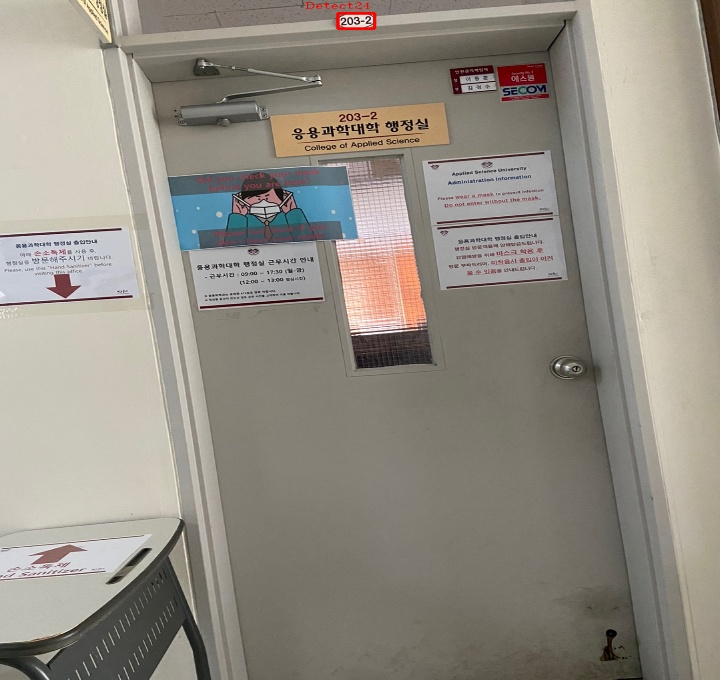
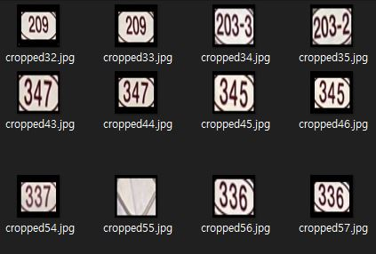
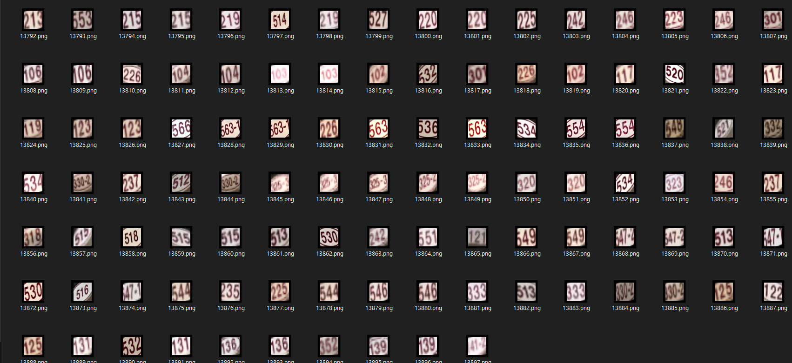

# Video Processing Module - with OpenCV [Python]

## Human Detection
* Human Detection Module with OpenCV

## Text Detection
* Text Area Crop from Realtime Video.

## Schedule
  * 4/6~4/12 : Setting Dev environment, implement HumanDetect Module
  * 4/13~4/19 : implement Text Image Crop module, Considering noise reduction measures

## Current Proress
    * HumanDetection Module : HOG Descriptor 사용, 사람객체 인식 구현 완료. 추후 프레임을 섹션별로 나누어 객체의 위치 추정.
			[04.16] 객체 위치 파악, 회피 동선 화면 표시 구현 완료
			[04.22] Object Detect 결과값 1차원 인덱스로 전달, 오브젝트가 차지하지 않는 부분의 인덱스값 증가기능 구현계획
			[04.23] 라즈베리파이 카메라 장착, 해상도 320*240으로 결정 - Human Detection모듈

    

    * TextDetection Module : Crop전략별 정확도 및 속도 비교분석, ML모듈 백데이터 구축 진행중.
			[04.16] 현재 크롭모듈 정확도 (84%)100장 이미지 기준
			[04.18] 데이터셋 약 14000장 수집, 각도를 -15~15도로 변경하여 기존에 찍었던 사진을 다각화하여 구성함.
				GUI 코드를 작성하여 라벨링하는 프로그램 구성 예정, 추후 라벨링 작업 진행 예정.
			[04.22] 라벨링 작업 진행 [3000/7000]

